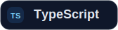
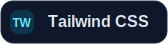
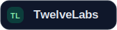
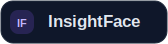
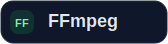

<h1 align="center">GDPR Video Redaction</h1>

Detect, track, and redact faces, people, objects, and custom regions in video footage to support GDPR and privacy-first review workflows from a single application.

The frontend is a Vite + React + Tailwind app. The backend is a Python/Flask API that combines TwelveLabs video understanding with local computer vision for detection, tracking, and export.

---

## Features

Everything you need for privacy safe video review and redaction:

🧠 **TwelveLabs-powered video understanding** — Index videos, retrieve scene context, and generate people/object summaries that guide review workflows.

🎯 **Local face and object redaction** — Detect faces with OpenCV + InsightFace, detect objects with Ultralytics YOLO, and blur or black out selected targets.

🧑‍💼 **Entity management** — Build a reusable library of known individuals, upload face assets, and search indexed footage by entity.

🔍 **Natural language and image-assisted search** — Search inside indexed videos using text queries, uploaded images, or image URLs.

⏱️ **Temporal optimization** — Use person/entity time ranges to focus redaction on the parts of a video where selected targets actually appear.

🖍️ **Manual region redaction with tracking preview** — Draw custom regions, preview motion tracking, and redact content even when automated detection is not enough.

📦 **Export-ready output** — Render redacted videos and re-encode to H.264 MP4 with FFmpeg when available for better playback compatibility.

---

## Tech Stack

### Frontend

<p>
  
  
  
  
</p>

### Backend

<p>
  
  
  
  
  
  
  
</p>

---

### Who this is for

- **Privacy and compliance teams** — Redact personal data before footage is shared, published, or archived.
- **Media and broadcast operations** — Speed up anonymization workflows for interviews, documentary footage, and B-roll.
- **Legal and investigation teams** — Review indexed footage, locate subjects of interest, and export privacy-safe evidence copies.
- **Product and AI demo teams** — Showcase video understanding plus redaction workflows in a single sample application.

---

## Local Setup

1. **Clone the repository**

```bash
git clone https://github.com/Hrishikesh332/tl-GDPR-compliance-redaction.git
cd tl-GDPR-compliance-redaction
```

1. **Set up the backend**

```bash
cd backend
python3 -m venv .venv
source .venv/bin/activate
pip install -r requirements.txt
```

1. **Create `backend/.env`**

Add your TwelveLabs configuration:

```bash
TWELVELABS_API_KEY="your_twelvelabs_api_key"
TWELVELABS_INDEX_ID="your_twelvelabs_index_id"
TWELVELABS_ENTITY_COLLECTION_ID=""
```

`TWELVELABS_ENTITY_COLLECTION_ID` is optional. The app can create or resolve the entity collection when the entity APIs are available.

1. **Run the backend**

```bash
cd backend
source .venv/bin/activate
python app.py
```

The Flask API runs at `http://localhost:5001`.

1. **Set up the frontend**

In a new terminal from the repository root:

```bash
cd frontend
npm install
```

1. **Create `frontend/.env`**

```bash
VITE_API_URL="http://localhost:5001"
```

1. **Run the frontend**

```bash
cd frontend
npm run dev
```

The frontend runs at `http://localhost:5173`.

---

## Workflow

1. **Index and analyze a video** — Upload footage and let TwelveLabs generate searchable video context.
2. **Review people, objects, and scenes** — Use the dashboard/editor to inspect detections and summaries.
3. **Select what should be redacted** — Choose faces, entities, object classes, or draw custom regions.
4. **Track targets through motion** — Apply OpenCV-based tracking with fallbacks for more stable redaction across frames.
5. **Render and export** — Generate the final redacted asset and download the output file.

---

## Powered by TwelveLabs + Local CV

This app combines multimodal video understanding with local redaction logic:

- **TwelveLabs indexing and search** — Semantic video search, video-level metadata, person/object summaries, and scene context.
- **Entity workflows** — Upload face assets, build reusable person entities, and retrieve time ranges for targeted redaction.
- **Local detection and tracking** — OpenCV face detection, InsightFace embeddings, YOLO object detection, and tracker-assisted motion handling.
- **Video export pipeline** — Render blurred or blacked-out regions and optionally re-encode output with FFmpeg.

---

## Core Use Cases

- **GDPR and privacy compliance** — Remove personal data before external sharing or long-term storage.
- **Interview and documentary cleanup** — Blur bystanders, devices, screens, or identifying objects in editorial footage.
- **Security footage handling** — Protect identities in CCTV and access-control recordings while preserving useful context.
- **Evidence preparation** — Produce privacy-safe video copies for legal review, internal investigations, or stakeholder distribution.

---

## Queries

For any doubts or help, you can reach out via `hrishikesh3321@gmail.com`.
